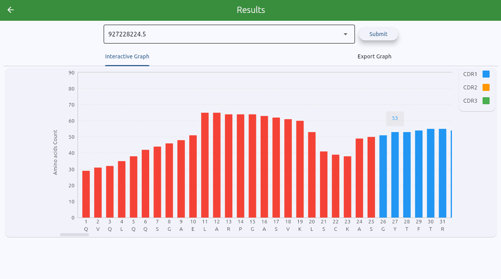
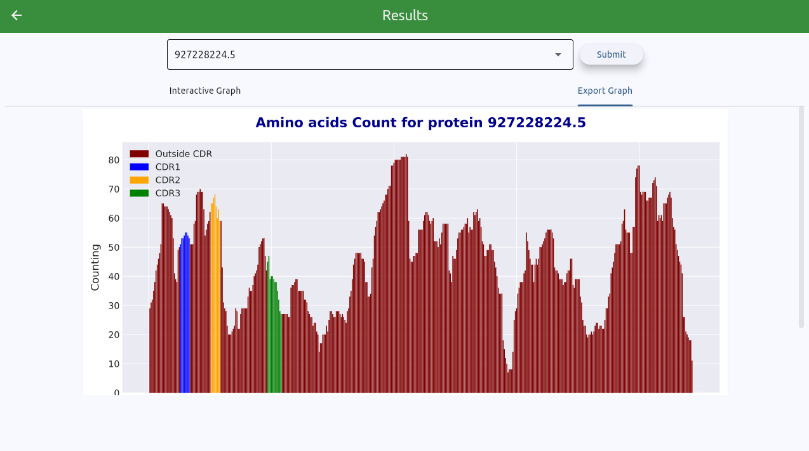

# Amino Acids Counter

## Overview
This project processes CSV files exported from the PEAKS software. The input CSV file should contain the following columns:

- **Protein Accession**
- **Start**
- **End**
- **Peptide**

From this data, the application counts the amino acids by position in the sequence and generates an interactive histogram. The histogram displays amino acid coverage, including critical regions such as CDRs (Complementarity-Determining Regions).

## Features
- Parses CSV files containing peptide sequences data
- Counts amino acid occurrences by position
- Generates an interactive histogram visualization
- Displays CDR coverage alongside amino acid frequencies

## Screenshots

*Example of the interactive histogram generated by the application.*


*Example of the downloadable histogram generated.*

## Usage
1. Access https://proteomics.bioinfo.unifesp.br/tool/
2. Provide a CSV file in the correct format.
3. View the generated histogram and analyze the CDR coverage.

## Requirements
- Python 3.x
- Flet 0.27.x
- Matplotlib
- Numpy
- Pandas
- crowelab_pyir (and every requisite that this wrapper needs)

# Build in Linux

## Locally

1. Create a local Docker image with the following command:

    ```bash
    sudo docker build -t amino_acids_counter .
    ```

2. Log in to your Docker account in the terminal using the following command:

    ```bash
    sudo docker login -u <your-username>
    ```

3. Use this command to create a tag for the repository:

    ```bash
    sudo docker tag amino_acids_counter:latest <your-username>/amino-acids-tool:vn
    ```

4. Finally, push your local image to the Docker Hub repository:

    ```bash
    sudo docker push <your-username>/amino-acids-tool:vn
    ```

## Server Side

1. Log in to your Docker account in the terminal using the following command:

    ```bash
    sudo docker login -u <your-username>
    ```

2. See if an old version is running and if so, stop it:

    ```bash
    sudo docker ps
    sudo docker stop <container-id>
    ```

3. Pull the image from the repository and run:

    ```bash
    sudo docker pull <your-username>/amino-acids-tool:vn
    sudo docker run -d -p 8080:8000 <your-username>/amino-acids-tool:vn
    ```


# Contributing
Feel free to submit pull requests or report issues.

## License
This project is licensed under the MIT License.

---
Developed by Pedro Andrade

